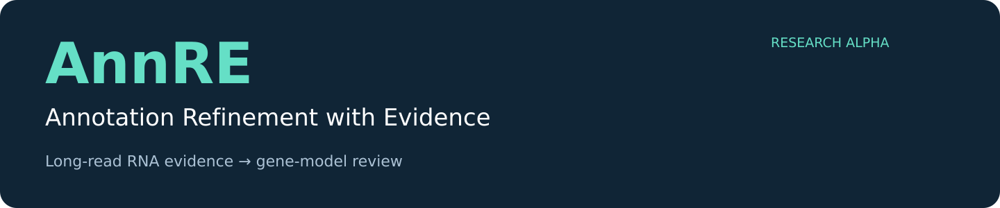
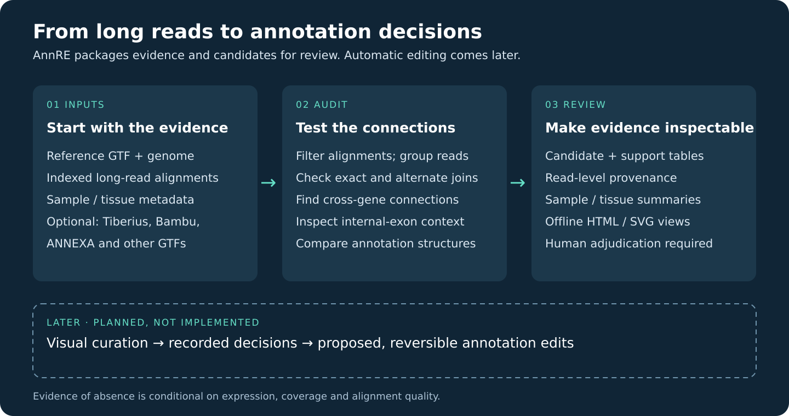

<p align="center"></p>

<p align="center"><strong>Evidence first. Annotation decisions you can trace.</strong><br>Early research prototype · Python 3.10+ · Long-read RNA annotation QC</p>

**AnnRE** tests existing gene structures against long-read RNA evidence and packages the results for review. It helps identify potential fused annotations, connections between separate reference genes, and alternative exon structures. Genome-based predictions and transcript assemblies provide complementary context.

> **Generated with OpenAI Codex and OpenAI models; reviewed and guided by Andreas Bachler.** See [development attribution](ACKNOWLEDGEMENTS.md).

## From evidence to review



| Available in this alpha | Planned; not implemented |
|---|---|
| Reference-junction evidence audit | Interactive visual curation module |
| Cross-gene junction and internal-exon-context candidates | Review decisions, notes and history in one interface |
| Comparisons with alternate GTF annotations | Proposed edits with a reversible change record |
| Sample/tissue support, read audits and offline SVG/HTML reports | Portable, indexed whole-genome engine and independent benchmarking |

AnnRE currently produces **review candidates**. It does not automatically split or merge genes, and it does not assign validated error probabilities. Existing Tiberius predictions supply ML-derived context; no new ML classifier has been trained here.

## Quick start

Install from a local clone using Python 3.10+:

```bash
python -m pip install .
annre --version
python -m unittest discover -s tests -v
```

Supply a FASTA with `.fai`, reference GTF, indexed coordinate-sorted BAMs and a sample sheet. Optional alternate GTFs may come from Tiberius, Bambu, ANNEXA or another source. Edit [examples/config.json](examples/config.json) and [examples/samples.tsv](examples/samples.tsv) for your files.

```bash
annre prepare --config examples/config.json --out run
annre extract --run run --library 0
# Repeat extract for EVERY sample-sheet row, using zero-based indices.
annre report --run run
```

Open `run/index.html`. The report requires all libraries to finish; it refuses incomplete evidence. For larger panels, submit one library per task using the [SLURM example](examples/slurm.sh).

Start with selected genes. The portable alpha has been demonstrated on a ten-gene panel; it is not a benchmarked whole-genome pipeline. [Methods, thresholds and file schemas](docs/METHODS.md) explain the evidence rules and limitations.

## What we see in BSF

A separate project-wide census and follow-up audit examined **77,385 reference introns across 13,912 genes**, using 72 libraries grouped into 68 sample IDs. The refined review set contains **105 genes / 116 suspect joins**, including 55 genes with nearby alignment-end evidence. Existing Bambu and ANNEXA outputs retain all 116 joins.

These are **candidate counts, not 105 confirmed errors or a measured accuracy improvement**. Three cases were removed from the initial 108-gene shortlist after shorter-anchor junction support was found. The genome-wide analysis used project-specific census workflows; it was not performed by running this portable alpha genome-wide. See [the BSF evidence summary](docs/BSF_RESULTS.md).

## Outputs you can inspect

- Candidate and alternative-junction tables with explicit coordinates and evidence categories.
- Sample/tissue support, with top-up libraries grouped under the same sample ID.
- Read-level audit records and provenance checksums.
- Offline HTML and SVG views of reference models, alternate annotations and observed read chains.

Supporting reads are movie/ZMW-deduplicated observations within sample in PacBio mode, not original RNA molecule counts. Missing RNA evidence alone does not establish an annotation error.

## Roadmap

1. **Now:** a reproducible evidence-to-review MVP, transparent methods and a small demonstration.
2. **Next:** independent adjudication, additional negative controls and scalable discovery.
3. **Later:** a lightweight visual curation module to record decisions, notes and reviewer history.
4. **After validation:** proposed annotation edits with provenance and a reversible change record.

The curation module is deliberately parked for this release.

## Project information
Target repository: [Andy-B-123/AnnRE](https://github.com/Andy-B-123/AnnRE).

The working name is **AnnRE — Annotation Refinement with Evidence**. `annre` is the command-line name. This is an alpha research preview; report reproducible issues and include the relevant input schema and software version.
